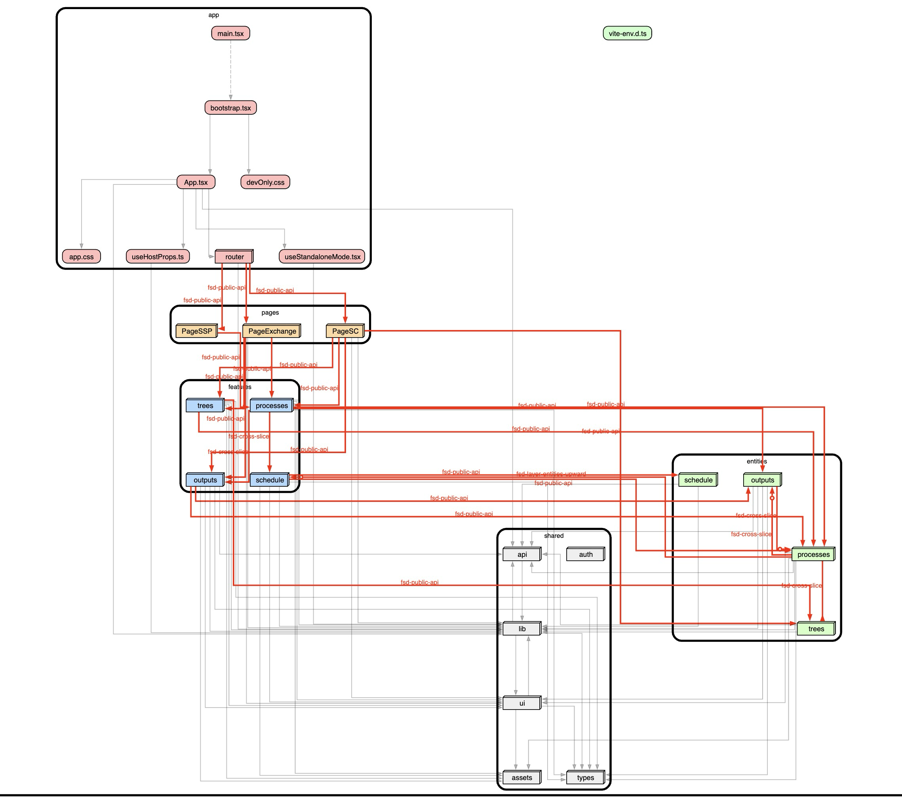

# [fsd-cruise](https://www.npmjs.com/package/fsd-cruise)

> `Currently in Beta`

[npm]: https://www.npmjs.com/package/fsd-cruise

[][npm]

Simple dependency visualization for [Feature Sliced Design](https://feature-sliced.design/) based on [dependency-cruiser](https://www.npmjs.com/package/dependency-cruiser)

## Requirements & Limitations

> **requirements:** dependency-cruiser requires the `graphviz` library, you can install it using `brew`

> **limitations:** Currently, it only operates with the provided `tsconfig.json` and `src` folder paths, which are assumed by default to be in the root directory.

## Usage

### Run with npx (recommended)

```shell
npx fsd-cruise
```

### Or install locally and run using either Node or npm scripts

```shell
npm i fsd-cruise -D

# Node usage variant
node node_modules/fsd-cruise/bin.js

# NPM scripts usage variant
# add to package.json scripts -> "generate:fsd-cruise": "node node_modules/fsd-cruise/bin.js"
```

## Customization

You can provide custom paths to your `src` folder and `tsconfig.json`. By default, only a high-level `fsd-high-level-dependencies.html` file is generated (collapsed to a folder depth of 3).

```shell
npx fsd-cruise app/src app/tsconfig.json
```

### Detailed Graph Generation

If you want an additional interactive canvas showing detailed file-level relationships within your architecture, you can use the `--detailed` flag (takes significantly more time). You can also specify the `--depth` (default 4) to dictate how deep the folders in the detailed graph should be collapsed:

```shell
# Generate the high-level graph AND the detailed graph with the default depth of 4
npx fsd-cruise --detailed

# Generate the detailed graph and specify the collapse depth explicitly
npx fsd-cruise --detailed --depth 5
```

## Output example


